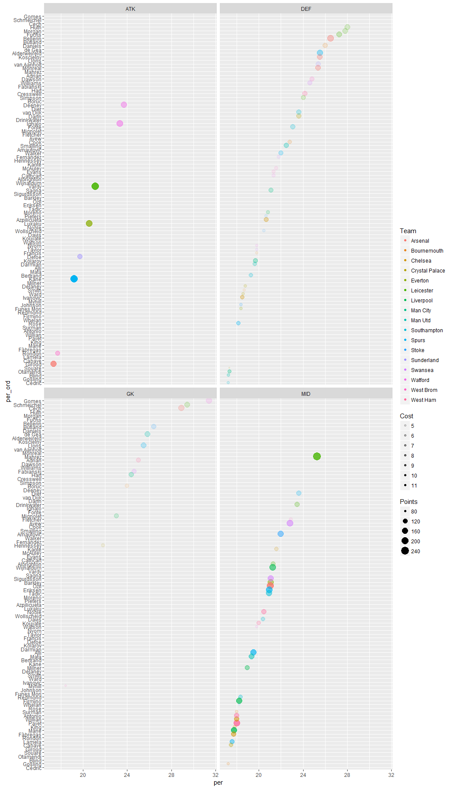

# Scrape them points
Dominic Pearce  


##Libraries


```r
library(rvest)
library(magrittr)
library(tibble)
library(ggplot2)
library(plotly)
```
##Get player data
####The webpage contains a bunch of tables with player, team, points (last seasons total) and cost but needs to be rearranged


```r
#Get data
points.html <- read_html("https://fantasy.premierleague.com/player-list/") %>%
  html_nodes("td") %>%
  html_text()

#Four categories, so split using sequences of 4 (i.e. 1-4, 5-8 etc.) to rearrange
points.dfr <- lapply(1:4, function(x) {
  points.html[seq(x, length(points.html), 4)]
  }
  ) %>% data.frame %>% as_tibble()

#Organise column names, remove £-sign and change column classes
colnames(points.dfr) <- c("Name", "Team", "Points", "Cost")
points.dfr$Name <- make.unique(as.character(points.dfr$Name))
points.dfr$Points <- as.numeric(as.character(points.dfr$Points))
points.dfr$Cost <- gsub("£", "", points.dfr$Cost)
points.dfr$Cost <- as.numeric(points.dfr$Cost)
```

##Assign position
####All players scraped as one big lump of text and position information was lost. *BUT*, using the last player in each section from the website we can quickly assign the correct positions


```r
flanking.players <- c("Nordfeldt", "Gamboa", "Cullen", "Vydra")

final.rows <- c(0, sapply(flanking.players, function(x) which(points.dfr$Name == x)))

points.dfr$Position <- rep(c("GK", "DEF", "MID", "ATK"), diff(final.rows))
```

##Calculate points-per-cost and plot


```r
points.dfr$per <- points.dfr$Points / points.dfr$Cost
points.dfr$per_ord <- factor(points.dfr$Name, levels = points.dfr$Name[order(points.dfr$per)])

points.dfr <- points.dfr[order(points.dfr$per, decreasing = TRUE),]


ggplot(points.dfr[1:100,], aes(y = per_ord, x = per, colour = Team)) + geom_point() + facet_wrap(~Position)
```

<!-- -->

